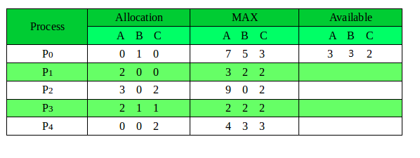

# Banker-s-Algorithm

The banker’s algorithm is a resource allocation and deadlock avoidance algorithm that tests for safety by simulating the allocation for predetermined maximum possible amounts of all resources, then makes an “s-state” check to test for possible activities, before deciding whether allocation should be allowed to continue.

Following Data structures are used to implement the Banker’s Algorithm:

Let ‘n’ be the number of processes in the system and ‘m’ be the number of resources types.

**Available :**

- It is a 1-d array of size ‘m’ indicating the number of available resources of each type.
- Available[ j ] = k means there are ‘k’ instances of resource type Rj

**Max :**

- It is a 2-d array of size ‘n\*m’ that defines the maximum demand of each process in a system.
- Max[ i, j ] = k means process Pi may request at most ‘k’ instances of resource type Rj.

**Allocation :**

- It is a 2-d array of size ‘n\*m’ that defines the number of resources of each type currently allocated to each process.
- Allocation[ i, j ] = k means process Pi is currently allocated ‘k’ instances of resource type Rj

**Need :**

- It is a 2-d array of size ‘n\*m’ that indicates the remaining resource need of each process.
- Need [ i, j ] = k means process Pi currently allocated ‘k’ instances of resource type Rj
- Need [ i, j ] = Max [ i, j ] – Allocation [ i, j ]

Allocationi specifies the resources currently allocated to process Pi and Needi specifies the additional resources that process Pi may still request to complete its task.

Banker’s algorithm consist of Safety algorithm and Resource request algorithm.

**Safety Algorithm**
The algorithm for finding out whether or not a system is in a safe state can be described as follows:

- Let Work and Finish be vectors of length ‘m’ and ‘n’ respectively.
  Initialize: Work= Available
  Finish [i]=false; for i=1,2,……,n
- Find an i such that both
  a) Finish [i]=false
  b) Need_i<=work

if no such i exists goto step (4)

- Work=Work + Allocation_i
  Finish[i]= true
  goto step(2)
- If Finish[i]=true for all i,
  then the system is in safe state.
  **Safe sequence is the sequence in which the processes can be safely executed.**

  ## Illustration :

  > _Considering a system with five processes P0 through P4 and three resources types A, B, C._ > _Resource type A has 10 instances, B has 5 instances and type C has 7 instances. Suppose at time t0 following snapshot of the system has been taken:_
  > 
